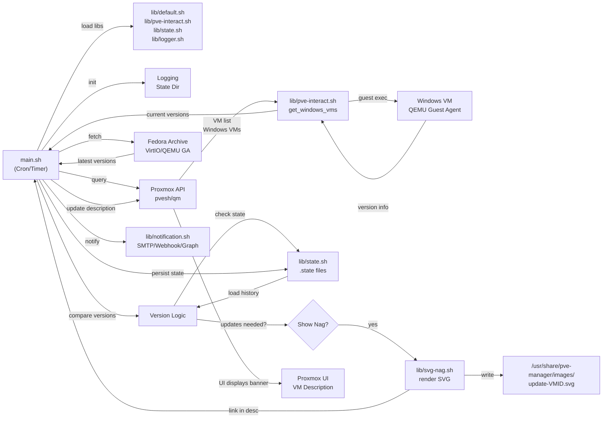

# PVE-QEMU-VirtIO-Updater


Keep your VirtIO drivers and QEMU Guest Agent up to date on Proxmox VE. Inspired by how vCenter shows "VMware Tools update available"

## What is this?

I got tired of manually checking if my Windows VMs on Proxmox had outdated VirtIO drivers and QEMU Guest Agent versions. VMware's vCenter does this elegantly with a nice warning in the VM Overview, so I decided to build something similar for Proxmox VE.

**PVE-QEMU-VirtIO-Updater** is a host-side monitoring system that:

- **Discovers Windows VMs** on your Proxmox cluster automatically
- **Detects installed versions** of VirtIO drivers and QEMU Guest Agent via QEMU Guest Agent queries
- **Fetches latest releases** from Fedora People Archive
- **Displays update banners** in the Proxmox UI when updates are available (SVG nags)
- **Tracks state persistently** to avoid duplicate notifications and detect VM clones/restores
- **Optional guest-side updater** (PowerShell script) for in-VM automated updates

## Current Status

⚠️ **Work in Progress** - I'm building this as I have time.

**What works:**
- Host-side version detection (VirtIO + QEMU GA)
- SVG update notifications in Proxmox UI (Kind of 🙃)
- VM description updates (won't (shouldn't) break your existing VM notes)
- State tracking with vmgenid clone detection
- PowerShell guest updater script for VirtIO
- Logging framework (journal/syslog)

**Not Implemented Yet:**
- Notification channels (SMTP, webhook, MS Graph) - placeholders only
- Self-update mechanism - stub only
- Documentation may be ahead of actual code

## How it Works



**Workflow:**

1. **Initialization**: `main.sh` sources libraries, initializes logging, creates state directory
2. **Dependency Check**: Verify curl, jq, pvesh, qm, sed, awk are available
3. **VM Discovery**: Query Proxmox API for all Windows VMs on cluster
4. **Version Fetch**: Download latest VirtIO and QEMU GA versions from Fedora Archive
5. **Per-VM Check**:
   - Query guest OS for installed versions via QEMU Guest Agent
   - Compare against latest available
   - Load previous state to detect clones/restores (vmgenid tracking)
6. **Nag Decision**:
   - If updates available and state changed (or first run): render SVG, update VM description, save new state
   - If VM already up-to-date: remove any existing nag banner
7. **State Persistence**: Track vmgenid, versions, nag status per VM

## Visual Examples

### Update Banner in Proxmox UI


*SVG banner for VirtIO or QEMU GA update (single component)*


*SVG banner when both VirtIO and QEMU GA updates are available*

> **Note:** Screenshots coming soon. Banners appear in the VM Summary/Description area of the Proxmox web UI.

## Requirements

### Host Requirements (Proxmox Node)

- Proxmox VE 8.0+ (tested on 8.x and 9.x)
- Bash 4.0+
- Required utilities: `jq`, `curl`, `pvesh`, `qm`, `sed`, `awk`, `grep`

### Guest Requirements (Optional - for guest-side updater)

- Windows 10/11 or Windows Server 2016+ -> I don't have older systems to test on...
- PowerShell 7.0+
- QEMU Guest Agent installed and running

## Configuration

All configuration is managed via `.env` file. Copy `.env.example` to `.env` and customize as needed:

```bash
cp .env.example .env
```

Key configuration options:
- **Logging**: `LOG_LEVEL`, `LOG_FORMAT`, `LOG_DIR`
- **State Management**: `STATE_DIR`
- **SVG Templates**: `SVG_IMAGE_PATH`, `SVG_IMAGE_TEMPLATE`
- **Notifications** (not implemented): `NOTIFICATION_CHANNELS`, SMTP/webhook/MS Graph settings

For complete configuration reference, see [Configuration Documentation](docs/03-configuration.md).

## Quick Start

### Option 1: Update from inside a Windows VM (Guest-Side)

```powershell
# Just run this in PowerShell 7
.\updater-win.ps1
```

### Option 2: Host-Side Monitoring (Recommended)

```bash
# Clone the repository
git clone https://github.com/fs1n/PVE-QEMU-VirtIO-Updater.git
cd PVE-QEMU-VirtIO-Updater

# Create configuration
cp .env.example .env
# Edit .env as needed (optional - defaults work for most setups)

# Make scripts executable
chmod +x main.sh update.sh

# Run manually for testing
./main.sh

# Schedule via cron (runs daily at 2 AM)
echo "0 2 * * * /path/to/PVE-QEMU-VirtIO-Updater/main.sh" | crontab -
```

For detailed installation, configuration, and scheduling options, see the [Installation Documentation](docs/02-installation.md).

## Known Limitations

⚠️ **Current WIP Limitations:**

- **Notification Channels**: SMTP, MS Graph, and webhook integrations are placeholder code only (see `lib/notification.sh`)
- **Self-Update**: `update.sh` is a stub header with no implementation
- **Documentation Drift**: Documentation in `docs/` may describe features not yet fully implemented
- **All Features**: Treat everything as work-in-progress and subject to change

## Roadmap

> **Note:** These are planned features, not commitments. Timelines are uncertain.

- [ ] **Notification Implementation**: Complete SMTP, webhook, and MS Graph notification channels
- [ ] **Self-Update Mechanism**: Implement `update.sh` for script auto-updates
- [ ] **Linux Guest Support**: Extend guest updater to support Linux VMs (apt/yum/dnf)
- [ ] **Enhanced Clone Detection**: Improve vmgenid tracking and state validation
- [ ] **Error Handling**: Better error recovery and logging granularity
- [ ] **Multi-Language Support**: i18n for log messages and UI elements

## Documentation

Full documentation is available in the `docs/` directory:

- [Overview & Architecture](docs/01-overview.md)
- [Installation Guide](docs/02-installation.md)
- [Configuration Reference](docs/03-configuration.md)
- [Operation & Usage](docs/04-operation.md)
- [Troubleshooting](docs/05-troubleshooting.md)

**MkDocs Site**: Documentation site can be generated via `./generate-docs.sh` (requires MkDocs with Material theme).

## License

This project is licensed under the MIT License. See the [LICENSE](LICENSE) file for details.

---

**Contributors**: Frederik S. (fs1n) and PVE-QEMU-VirtIO-Updater Contributors

**Inspired by**: VMware vCenter's "VMware Tools update available" notification system
