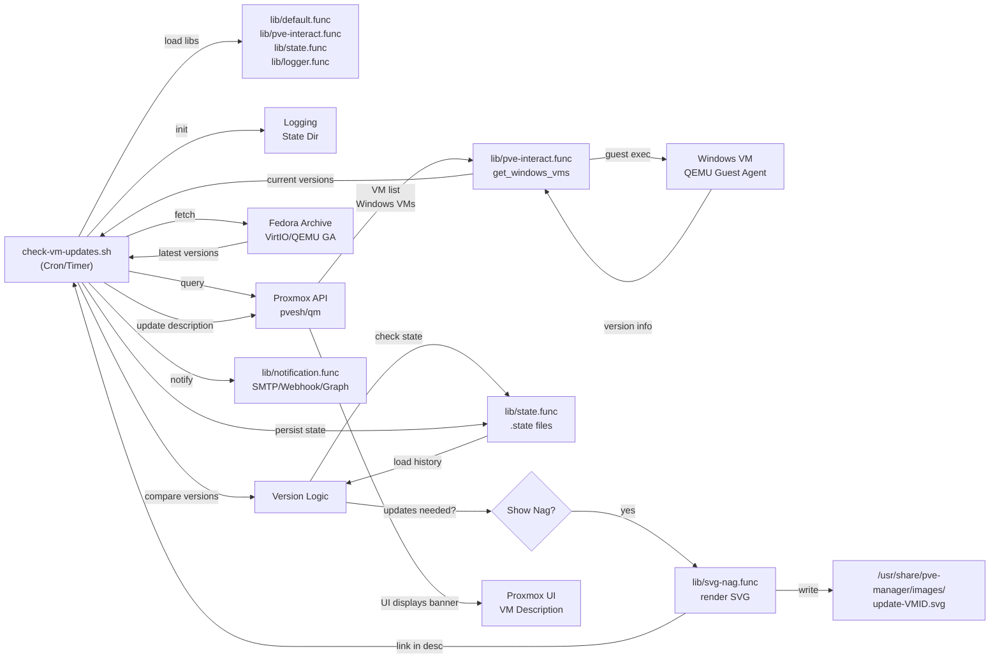

# PVE-QEMU-VirtIO-Updater


## What is this?

I got tired of manually checking if my Windows VMs on Proxmox had outdated VirtIO drivers and QEMU Guest Agent versions. VMware's vCenter does this elegantly with a nice warning in the VM Overview, so I decided to build something similar for Proxmox VE.

**PVE-QEMU-VirtIO-Updater** is a host-side monitoring system that:

- **Discovers Windows VMs** on your Proxmox cluster automatically
- **Detects installed versions** of VirtIO drivers and QEMU Guest Agent via QEMU Guest Agent queries
- **Fetches latest releases** from Fedora People Archive
- **Displays update banners** in the Proxmox UI when updates are available (SVG nags)
- **Tracks state persistently** to avoid duplicate notifications and detect VM clones/restores
- **Optional guest-side updater** (PowerShell script) for in-VM automated updates

## Current Status

⚠️ **Work in Progress** - I'm building this as I have time.

**What works:**
- Host-side version detection (VirtIO + QEMU GA)
- SVG update notifications in Proxmox UI (Kind of 🙃)
- VM description updates (won't (shouldn't) break your existing VM notes)
- State tracking with vmgenid clone detection
- PowerShell guest updater script for VirtIO
- Logging framework (journal/syslog)

**Not Implemented Yet:**
- Notification channels (SMTP, webhook, MS Graph) - placeholders only
- Self-update mechanism - stub only
- Documentation may be ahead of actual code

## How it Works


```mermaid
graph LR
    A["check-vm-updates.sh<br/>(Cron/Timer)"] -->|load libs| B["lib/default.func<br/>lib/pve-interact.func<br/>lib/state.func<br/>lib/logger.func"]
    A -->|init| C["Logging<br/>State Dir"]
    A -->|query| D["Proxmox API<br/>pvesh/qm"]
    D -->|VM list<br/>Windows VMs| E["lib/pve-interact.func<br/>get_windows_vms"]
    E -->|guest exec| F["Windows VM<br/>QEMU Guest Agent"]
    F -->|version info| E
    E -->|current versions| A
    A -->|fetch| G["Fedora Archive<br/>VirtIO/QEMU GA"]
    G -->|latest versions| A
    A -->|compare versions| H["Version Logic"]
    H -->|check state| I["lib/state.func<br/>.state files"]
    I -->|load history| H
    H -->|updates needed?| J{"Show Nag?"}
    J -->|yes| K["lib/svg-nag.func<br/>render SVG"]
    K -->|write| L["/usr/share/pve-manager/images/<br/>update-VMID.svg"]
    K -->|link in desc| A
    A -->|update description| D
    D -->|UI displays banner| M["Proxmox UI<br/>VM Description"]
    A -->|persist state| I
    A -->|notify| N["lib/notification.func<br/>SMTP/Webhook/Graph"]
```

**Workflow:**

1. **Initialization**: `check-vm-updates.sh` sources libraries, initializes logging, creates state directory
2. **Dependency Check**: Verify curl, jq, pvesh, qm, sed, awk are available
3. **VM Discovery**: Query Proxmox API for all Windows VMs on cluster
4. **Version Fetch**: Download latest VirtIO and QEMU GA versions from Fedora Archive
5. **Per-VM Check**:
   - Query guest OS for installed versions via QEMU Guest Agent
   - Compare against latest available
   - Load previous state to detect clones/restores (vmgenid tracking)
6. **Nag Decision**:
   - If updates available and state changed (or first run): render SVG, update VM description, save new state
   - If VM already up-to-date: remove any existing nag banner
7. **State Persistence**: Track vmgenid, versions, nag status per VM

## Requirements

### Host Requirements (Proxmox Node)

- Proxmox VE 8.0+ (tested on 8.x and 9.x)
- Bash
- Required utilities: `jq`, `curl`, `pvesh`, `qm`, `sed`, `awk`, `grep`

### Guest Requirements (So the Script can do it's thing)

- Windows 10/11 or Windows Server 2022+ -> I don't have older systems to test on...
- PowerShell 5xx
- QEMU Guest Agent installed and running

## Configuration

All configuration is managed via `.env` file. Copy `.env.example` to `.env` and customize as needed:

```bash
cp .env.example .env
```

Key configuration options:
- **Logging**: `LOG_LEVEL`, `LOG_FORMAT`, `LOG_DIR`
- **State Management**: `STATE_DIR`
- **SVG Templates**: `SVG_IMAGE_PATH`, `SVG_IMAGE_TEMPLATE`
- **Notifications** (not implemented): `NOTIFICATION_CHANNELS`, SMTP/webhook/MS Graph settings

# Installation

### Clone the repository
```bash
git clone https://github.com/fs1n/PVE-QEMU-VirtIO-Updater.git
cd PVE-QEMU-VirtIO-Updater
```

### Create configuration
```bash
cp .env.example .env
```

### Edit configuration (optional - defaults work for most setups)
```bash
nano .env
```

### Make scripts executable
```bash
chmod +x check-vm-updates.sh lib/*.func
```

### Run manually for testing
```bash
./check-vm-updates.sh
```

# Quick Start / Running

## Run manually for testing
```bash
cd /opt/pve-qemu-virtio-updater
./check-vm-updates.sh
```

## Schedule automatic execution

Choose one of the following methods to run the updater regularly (e.g., daily):

### Cron Job
```bash
# Runs daily at 2 AM
echo "0 2 * * * /opt/pve-qemu-virtio-updater/check-vm-updates.sh" | crontab -
```

# Known Limitations

⚠️ **Current WIP Limitations:**

- **Notification Channels**: Experimental, view lib/notifications.func to see implementation status.
- **All Features**: Treat everything as work-in-progress and subject to change

# Roadmap

> **Note:** These are planned features, not commitments. Timelines are uncertain.

- [ ] **Notification Implementation**: Complete SMTP, webhook, and MS Graph notification channels

# License

This project is licensed under the MIT License. See the [LICENSE](LICENSE) file for details.
