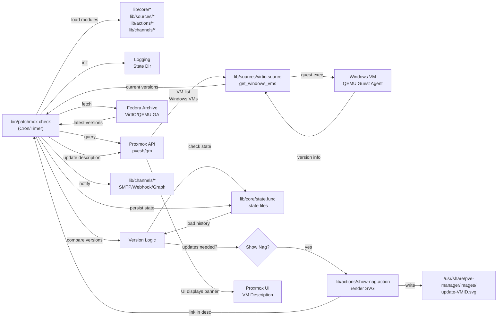

# PatchMox


## What is this?

I got tired of manually checking if my Windows VMs on Proxmox had outdated VirtIO drivers and QEMU Guest Agent versions. VMware's vCenter does this elegantly with a nice warning in the VM Overview, so I decided to build something similar for Proxmox VE.

**PatchMox** is a host-side monitoring system that:

- **Discovers Windows VMs** on your Proxmox cluster automatically
- **Detects installed versions** of VirtIO drivers and QEMU Guest Agent via QEMU Guest Agent queries
- **Fetches latest releases** from Fedora People Archive
- **Displays update banners** in the Proxmox UI when updates are available (SVG nags)
- **Tracks state persistently** to avoid duplicate notifications and detect VM clones/restores
- **Optional guest-side updater** (PowerShell script) for in-VM automated updates

## Current Status

⚠️ **Work in Progress** - I'm building this as I have time.

**What works:**
- Host-side version detection (VirtIO + QEMU GA)
- SVG update notifications in Proxmox UI (Kind of 🙃)
- VM description updates (won't (shouldn't) break your existing VM notes)
- State tracking with vmgenid clone detection
- PowerShell guest updater script for VirtIO
- Logging framework (journal/syslog)

**Not Implemented Yet:**
- Notification channels (SMTP, webhook, MS Graph) - placeholders only
- Self-update mechanism - stub only
- Documentation may be ahead of actual code

## How it Works


```mermaid
graph LR
    A["bin/patchmox check<br/>(Cron/Timer)"] -->|load modules| B["lib/core/*<br/>lib/sources/*<br/>lib/actions/*<br/>lib/channels/*"]
    A -->|init| C["Logging<br/>State Dir"]
    A -->|query| D["Proxmox API<br/>pvesh/qm"]
    D -->|VM list<br/>Windows VMs| E["lib/sources/virtio.source<br/>get_windows_vms"]
    E -->|guest exec| F["Windows VM<br/>QEMU Guest Agent"]
    F -->|version info| E
    E -->|current versions| A
    A -->|fetch| G["Fedora Archive<br/>VirtIO/QEMU GA"]
    G -->|latest versions| A
    A -->|compare versions| H["Version Logic"]
    H -->|check state| I["lib/core/state.func<br/>.state files"]
    I -->|load history| H
    H -->|updates needed?| J{"Show Nag?"}
    J -->|yes| K["lib/actions/show-nag.action<br/>render SVG"]
    K -->|write| L["/usr/share/pve-manager/images/<br/>update-VMID.svg"]
    K -->|link in desc| A
    A -->|update description| D
    D -->|UI displays banner| M["Proxmox UI<br/>VM Description"]
    A -->|persist state| I
    A -->|notify| N["lib/channels/*<br/>SMTP/Webhook/Graph"]
```

**Workflow:**

1. **Initialization**: `bin/patchmox check` sources libraries, initializes logging, creates state directory
2. **Dependency Check**: Verify curl, jq, pvesh, qm, sed, awk are available
3. **VM Discovery**: Query Proxmox API for all Windows VMs on cluster
4. **Version Fetch**: Download latest VirtIO and QEMU GA versions from Fedora Archive
5. **Per-VM Check**:
   - Query guest OS for installed versions via QEMU Guest Agent
   - Compare against latest available
   - Load previous state to detect clones/restores (vmgenid tracking)
6. **Nag Decision**:
   - If updates available and state changed (or first run): render SVG, update VM description, save new state
   - If VM already up-to-date: remove any existing nag banner
7. **State Persistence**: Track vmgenid, versions, nag status per VM

## Requirements

### Host Requirements (Proxmox Node)

- Proxmox VE 8.0+ (tested on 8.x and 9.x)
- Bash
- Required utilities: `jq`, `curl`, `pvesh`, `qm`, `sed`, `awk`, `grep`

### Guest Requirements (So the Script can do it's thing)

- Windows 10/11 or Windows Server 2022+ -> I don't have older systems to test on...
- PowerShell 5xx
- QEMU Guest Agent installed and running

## Configuration

All configuration is managed via `.env` file. Copy `.env.example` to `.env` and customize as needed:

```bash
cp .env.example .env
```

Key configuration options:
- **Logging**: `LOG_LEVEL`, `LOG_FORMAT`, `LOG_DIR`
- **State Management**: `STATE_DIR`
- **SVG Templates**: `SVG_IMAGE_PATH`, `SVG_IMAGE_TEMPLATE`
- **Notifications** (not implemented): `NOTIFICATION_CHANNELS`, SMTP/webhook/MS Graph settings

# Installation

You can run PatchMox from the cloned directory for testing, but for production use it should be installed under `/opt/patchmox`.

### Quick test (from the repo directory)
```bash
git clone https://github.com/fs1n/PVE-QEMU-VirtIO-Updater.git PatchMox
cd PatchMox
cp .env.example .env
chmod +x bin/patchmox check-vm-updates.sh vm-update.sh
./bin/patchmox check
```

### Recommended install location

For production use, install PatchMox under `/opt` and add the CLI to your PATH.

```bash
# 1. Clone to /opt
sudo git clone https://github.com/fs1n/PatchMox.git /opt/patchmox
cd /opt/patchmox

# 2. Create your config
sudo cp .env.example .env
sudo nano .env

# 3. Make the CLI executable
sudo chmod +x bin/patchmox check-vm-updates.sh vm-update.sh

# 4. Link the CLI into /usr/local/bin so it is available system-wide
sudo ln -sf /opt/patchmox/bin/patchmox /usr/local/bin/patchmox

# 5. Test it
patchmox check
```

## Schedule automatic execution

Choose one of the following methods to run the check regularly (e.g., daily).

### Cron Job
```bash
# Runs daily at 2 AM
sudo crontab -e
# Add:
0 2 * * * /opt/patchmox/bin/patchmox check
```

### Systemd timer (recommended)

Create `/etc/systemd/system/patchmox-check.service`:
```ini
[Unit]
Description=PatchMox update check
After=network.target

[Service]
Type=oneshot
ExecStart=/opt/patchmox/bin/patchmox check
WorkingDirectory=/opt/patchmox
```

Create `/etc/systemd/system/patchmox-check.timer`:
```ini
[Unit]
Description=Run PatchMox update check daily

[Timer]
OnCalendar=daily
Persistent=true

[Install]
WantedBy=timers.target
```

Then enable and start:
```bash
sudo systemctl daemon-reload
sudo systemctl enable --now patchmox-check.timer
```

# Known Limitations

⚠️ **Current WIP Limitations:**

- **Notification Channels**: Experimental, view lib/notifications.func to see implementation status.
- **All Features**: Treat everything as work-in-progress and subject to change

# Roadmap

> **Note:** These are planned features, not commitments. Timelines are uncertain.

- [ ] **Notification Implementation**: Complete SMTP, webhook, and MS Graph notification channels

# License

This project is licensed under the MIT License. See the [LICENSE](LICENSE) file for details.
