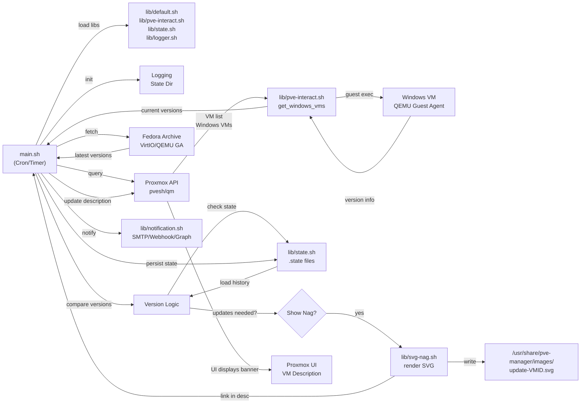

# Architecture Overview

## Project Purpose

The **PVE-QEMU-VirtIO-Updater** is a Proxmox VE automation tool that monitors Windows VMs for outdated VirtIO drivers and QEMU Guest Agent software. When updates are available, it creates visual update notifications (SVG banners) in the Proxmox UI and persists state to avoid duplicate notifications.

## Core Components

### Host-Side (Bash)

- **main.sh**: Orchestrator; runs update checks, manages VM workflows
- **lib/default.sh**: Version fetching from Fedora People Archive, core update logic
- **lib/pve-interact.sh**: Proxmox API wrapper (VM discovery, guest version queries)
- **lib/state.sh**: Persistent state management for tracking updates per VM
- **lib/svg-nag.sh**: SVG template rendering for update banners
- **lib/logger.sh**: Centralized logging with syslog/journal support
- **lib/notification.sh**: Extensible notification framework (SMTP, Webhook, MS Graph)

### Guest-Side (PowerShell)

- **updater-win.ps1**: Windows PowerShell script (run inside VMs to download/install updates)

### Templates

- **templates/svg/update-nag-template.svg**: SVG template for single-component updates
- **templates/svg/update-nag-both-template.svg**: SVG template for dual-component updates
- **templates/html/email-template.html**: Email notification template

## Data Flow Diagram

## Update Workflow

1. **Initialization**: main.sh sources libraries, initializes logging, creates state directory
2. **Dependency Check**: Verify curl, jq, pvesh, qm, sed, awk are available
3. **VM Discovery**: Query Proxmox API for all Windows VMs on cluster
4. **Version Fetch**: Download latest VirtIO and QEMU GA versions from Fedora Archive
5. **Per-VM Check**:
   - Query guest OS for installed versions via QEMU Guest Agent
   - Compare against latest available
   - Load previous state to detect clones/restores (vmgenid tracking)
6. **Nag Decision**:
   - If updates available and state changed (or first run): render SVG, update VM description, save new state
   - If VM already up-to-date: remove any existing nag banner
7. **Optional Notifications**: Send via configured channels (SMTP, MS Graph, Webhook)

## State Management

Each Windows VM gets a `.state` file tracking:

- **VMGENID**: Unique VM identifier (for clone detection)
- **VIRTIO_VERSION**: Last known VirtIO version
- **QEMU_GA_VERSION**: Last known QEMU GA version
- **NAG_ACTIVE**: Whether notification is currently displayed
- **LAST_CHECKED**: Timestamp of last check

When VM is cloned or restored, vmgenid changes → state file is cleared → nag shown again.

## Configuration

Environment variables (from `.env`):

| Variable | Default | Purpose |
|---|---|---|
| `LOG_DIR` | `<script>/logs` | Log file directory |
| `LOG_LEVEL` | `info` | Logging verbosity (debug/info/notice/warn/error) |
| `LOG_FORMAT` | `[%d] [%l] %m` | Log message format |
| `STATE_DIR` | `<script>/.state` | VM state files directory |
| `NOTIFICATION_CHANNELS` | *(empty)* | Comma-separated: smtp, msgraph, webhook |
| `SMTP_SERVER` | *(empty)* | SMTP host for email notifications |
| `WEBHOOK_URL` | *(empty)* | HTTP endpoint for webhook notifications |
| `MSGRAPH_TOKEN` | *(empty)* | Bearer token for MS Graph API |

## Deployment Model

Typically deployed as:

- **Host Setup**: Copy scripts to Proxmox node, create `.env` config, set up cron/systemd timer
- **VM Setup**: Optionally copy `updater-win.ps1` to Windows VMs for automated updates
- **Monitoring**: Check logs, adjust LOG_LEVEL as needed, monitor SVG nags in Proxmox UI

